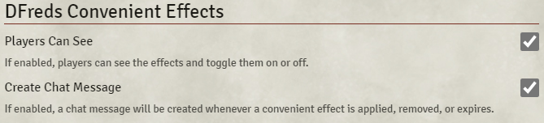

# DFreds Convenient Effects

__DFreds Convenient Effects__ is a FoundryVTT module that adds easy to use toggleable active effects for common use cases. Currently, the DND5e and SW5e systems have specific support, but any system can create custom effects.

## Let Me Sell You This

Do you struggle to remember what all those conditions and spells actually do to players and NPCs? Or how they interact? Consider this. Your player just rolled, but you forgot that they were invisible and should have rolled with advantage. But wait a minute, the enemy is also invisible! So now it cancels out. "Oh drats," you think to yourself to further prove this crazy point, "the player also has Bless cast on them! Has that expired yet??"

Sure, you could figure all that out... if you wanna be lame. Or you could be cool and just use this module.

## What This Module Does

This module helps with the types of issues described above by providing dozens of pre-configured effects for conditions and spells that can all be applied quickly and easily.

For a better idea of what this module does, check out the [demos](https://github.com/DFreds/dfreds-convenient-effects/wiki/Demos).

You can configure some stuff:

## How to Use

Check the [User Guide](https://github.com/DFreds/dfreds-convenient-effects/wiki/User-Guide) for details.

Developers should check out the [Developer Guide](https://github.com/DFreds/dfreds-convenient-effects/wiki/Developer-Guide).

## Required Modules

- [libWrapper](https://foundryvtt.com/packages/lib-wrapper) by ruipin - A library that wraps core Foundry methods to make it easier for modules developers to do their thang. Note that if you for some reason don't want to install this, a shim will be used instead. You'll be pestered to install it though so... [just do it](https://www.youtube.com/watch?v=ZXsQAXx_ao0)
- [socketlib](https://foundryvtt.com/packages/socketlib) by Stäbchenfisch - A library that makes it easy to do difficult things with sockets

## Modules That Help

While not strictly required, the functionalities provided by these modules drastically improve the usage of the various effects included in this module.

- [Times Up](https://foundryvtt.com/packages/times-up) by tposney - Deletes effects when their time is up or after a certain number of rounds or turns
- [DAE](https://foundryvtt.com/packages/dae) by tposney - With midi-qol, handles various additional expiration effects such as after 1 attack or when an enemy is attacked
- [Midi-QOL](https://foundryvtt.com/packages/midi-qol) by tposney - Handles a vast amount of automation relating to advantage and disadvantage
- [Active Token Lighting](https://foundryvtt.com/packages/ATL) by Kandashi - Certain effects and spells can emit light, and this module allows active effects to do that
- [Token Magic FX](https://foundryvtt.com/packages/tokenmagic) by SecretFire - Certain effects and spells can have an effect applied, and this module allows active effects to do that. Note that this requires DAE active as well.